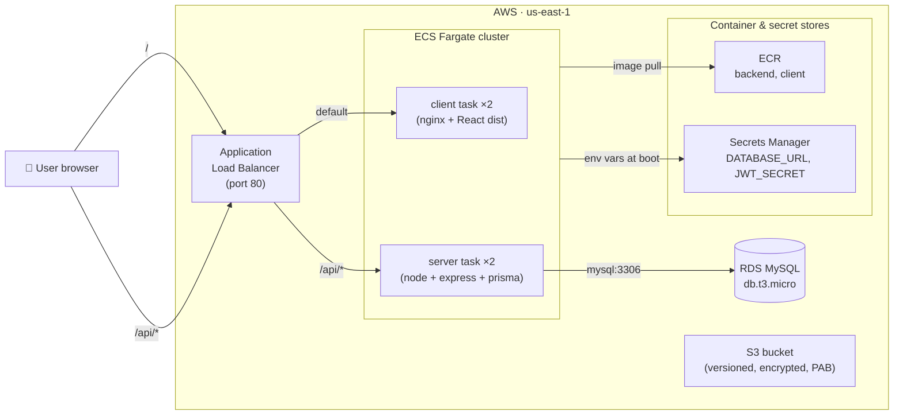

# ShopSmart

A small full-stack e-commerce app (React + Express + MySQL/Prisma) used as the demo project for the DevOps course. Pre-midsem the app was deployed manually to Render. Post-midsem it runs as containers on AWS ECS Fargate, behind an ALB, fronted by Terraform-managed infrastructure and a chained CI/CD pipeline.

> 📘 **For the post-midsem walkthrough** (what changed phase-by-phase, with examples + cost notes), see [POST-MIDSEM-NOTES.md](POST-MIDSEM-NOTES.md).
> 📋 **For rubric grading** (which file proves which line), see [SUBMISSION.md](SUBMISSION.md).

---

## Architecture



### Defense in depth (security groups)

- **ALB SG**: open to internet on port 80
- **ECS SG**: only accepts traffic from ALB SG (ports 80 + 5001)
- **RDS SG**: only accepts traffic from ECS SG (port 3306)

RDS is not reachable from the internet at all.

---

## Local development

### Option A — straight `npm run dev` (3 terminals)

```bash
# 0. Have MySQL running locally with a database called `shopsmart`
# 1. Backend
cd server
cp .env.example .env       # then edit DATABASE_URL + JWT_SECRET
npm install
npx prisma migrate deploy
npx prisma db seed         # 24 sample products across Men/Women/Kids/Accessories
npm run dev                # http://localhost:5001

# 2. Frontend
cd client
npm install
npm run dev                # http://localhost:5173/shopsmart/
```

### Option B — `docker compose up` (1 command)

Brings up MySQL + backend + nginx-served frontend with one command. Uses host ports `8080`, `5002`, `3307` to avoid clashing with anything you already run on `5173`, `5001`, `3306`.

```bash
docker compose up -d
docker compose --profile seed up seeder    # one-time seed
open http://localhost:8080
docker compose down                        # stop (keeps data)
docker compose down -v                     # stop + wipe MySQL volume
```

---

## Tests

```bash
# Backend (jest)
npm --prefix server test                # 17 tests
npm --prefix server run test:ci         # + JUnit XML + HTML coverage in test-results/ + coverage/

# Frontend (vitest)
npm --prefix client test                # 55 tests
npm --prefix client run test:ci         # + JUnit XML + HTML coverage

# E2E (playwright — boots backend + frontend automatically)
npm --prefix client run test:e2e        # 29 tests

# Lint
npm --prefix server run lint
npm --prefix client run lint
```

CI runs all four on every push (`tests.yml` workflow). Reports are uploaded as downloadable artifacts on each Action run.

---

## Cloud deployment (AWS)

The whole AWS stack is defined in [`infra/`](infra/) (Terraform) and rolled out by [`.github/workflows/pipeline.yml`](.github/workflows/pipeline.yml) on every push to `main`.

### Pipeline flow (matches rubric workflow order)

```
Push → Run Tests → Terraform Apply → Docker Build & Push → Deploy to ECS → Smoke test
```

Each job blocks the next via `needs:`. Smoke test fails the whole pipeline if `/api/health` doesn't return 200.

### Manual deploy from your laptop (when you want to skip CI)

```bash
cd infra
source ../.env.aws.local
export TF_VAR_db_password="$(openssl rand -base64 24 | tr -d '/+=' | head -c 24)"
terraform init
terraform apply
```

Then push the images and update the services. The pipeline does this for you, so manual is only needed for first-time bootstrap or recovery.

### Stop billing

**Always destroy when you're done for the day** — running infra costs ~$0.07/hour:

```bash
cd infra
source ../.env.aws.local
export TF_VAR_db_password="anything"   # value doesn't matter for destroy
terraform destroy -auto-approve
```

See [POST-MIDSEM-NOTES.md → Credits & Cost](POST-MIDSEM-NOTES.md#credits--cost) for the full pricing table.

---

## Required GitHub repository secrets

Settings → Secrets and variables → Actions:

| Secret                  | Used by   | Notes                                        |
| ----------------------- | --------- | -------------------------------------------- |
| `AWS_ACCESS_KEY_ID`     | pipeline  | AWS Academy Learner Lab — refresh every 4h   |
| `AWS_SECRET_ACCESS_KEY` | pipeline  | same                                         |
| `AWS_SESSION_TOKEN`     | pipeline  | same                                         |
| `AWS_REGION`            | pipeline  | `us-east-1`                                  |
| `DB_PASSWORD`           | terraform | RDS master password — set once, never change |

---

## Repository layout

```
shopsmart/
├── client/                  React + Vite frontend, served by nginx in production
├── server/                  Express + Prisma backend, MySQL on RDS in production
├── infra/                   Terraform — VPC, S3, ECR, RDS, ECS, ALB, CloudWatch
├── docker-compose.yml       Local-dev stack (mysql + server + client + seeder)
├── .github/workflows/
│   ├── pipeline.yml         Test → Terraform → Build/Push → Deploy → Smoke
│   ├── tests.yml            Standalone test/coverage workflow (runs on every push)
│   ├── secret-scan.yml      Gitleaks runs on every push/PR
│   └── …                    older workflows kept for reference (workflow_dispatch only)
├── .husky/pre-commit        Runs lint-staged → prettier on every git commit
├── POST-MIDSEM-NOTES.md     Walkthrough of post-midsem changes by phase
└── SUBMISSION.md            Rubric checklist with file paths
```

---

## Tech stack

- Frontend: React 18, Vite, Tailwind, react-router, Vitest, Playwright
- Backend: Node 20, Express, Prisma ORM, MySQL 8.0, JWT auth, bcrypt, Jest
- Infra: Terraform 1.9, AWS Academy LabRole, ECS Fargate, RDS, ALB, ECR, S3, Secrets Manager, CloudWatch
- CI/CD: GitHub Actions, gitleaks, husky, lint-staged, prettier, eslint, jest-junit, vitest coverage v8
